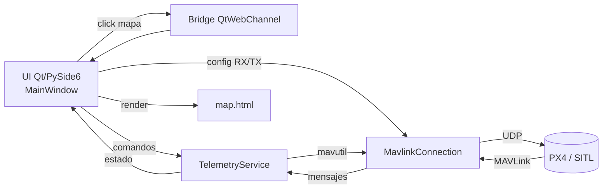
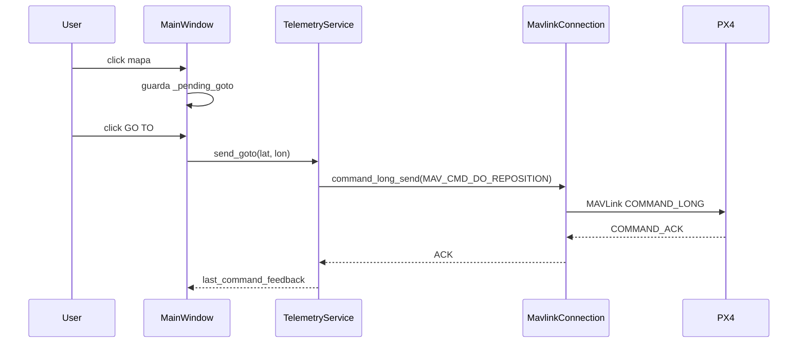

# Qt GCS - Notas de uso

GCS en Qt/PySide6 con mapa web embebido y control MAVLink básico (ARM, LAND, TAKEOFF, GO TO).

## Estructura rápida

- UI principal: `gcs/ui/main_window.py`
- Telemetría y comandos: `gcs/services/telemetry_service.py`
- Conexión MAVLink: `gcs/mavlink/connection.py`
- Mapa HTML: `gcs/ui/web/map.html`

## Diagramas

### Arquitectura general



### Flujo GO TO (DO_REPOSITION)



### Loop de telemetría

```mermaid
flowchart TD
  Start[TelemetryService.start] --> Thread[Hilo _run]
  Thread --> ConnCheck{Conectado?}
  ConnCheck -- No --> Connect[connect()]
  ConnCheck -- Sí --> HB[Enviar heartbeat si toca]
  HB --> RX[recv_match loop]
  RX --> Update[update_from_mavlink]
  Update --> UI[MainWindow.refresh_telemetry]
  UI --> Thread
```

## GO TO (DO_REPOSITION)

Implementa `MAV_CMD_DO_REPOSITION (192)` por `COMMAND_LONG`, igual que QGroundControl:

- `param1` ground speed: `-1` (mantener)
- `param2` flags: `1`
- `param3` unused: `0`
- `param4` yaw: `NaN` (no cambiar)
- `param5` lat, `param6` lon, `param7` alt (relativa)

No se envía `set_mode_send` en GO TO; se asume que el vehículo ya está en un modo que acepta reposicionamiento.

## MAVLink desde SITL (WSL) hacia la GCS en Windows

Para que el tráfico MAVLink llegue a la GCS en Windows, en la consola `pxh>` del SITL ejecuta:

```sh
mavlink stop-all
mavlink start -x -u 18570 -r 4000000 -f -m onboard -t 172.31.16.1
mavlink status
```

Esto fuerza el envío hacia la IP de Windows (`172.31.16.1`) y el puerto remoto `14550`.
